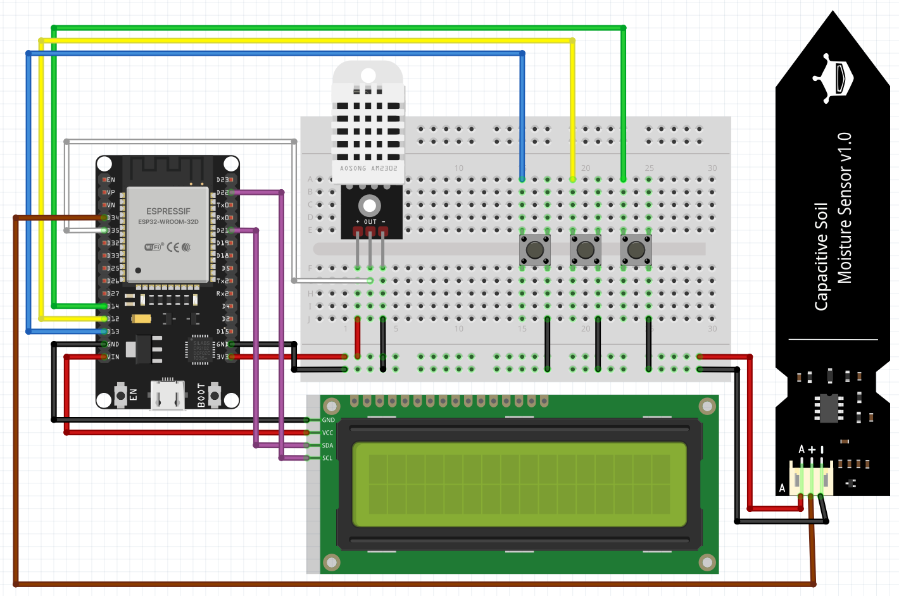

# 🌱 ESP32 Soil Sentinel

**A Smart Plant Monitoring System with Multi-Profile Support**



## 📋 Overview

ESP32 Soil Sentinel is an IoT-based plant monitoring system that tracks soil moisture, temperature, and humidity for multiple plants. Each plant has its own calibration profile and dedicated ThingSpeak cloud channel for data logging and remote monitoring.

### Key Features

- 🌿 **Multi-Plant Profiles** - Monitor different plants with individual calibration settings
- 📊 **Cloud Data Logging** - Automatic data upload to ThingSpeak IoT platform
- 🖥️ **LCD Display** - Real-time monitoring with 16x2 I2C display
- ⚙️ **Calibration Mode** - Easy sensor calibration for accurate readings
- 🎮 **Button Navigation** - Simple 3-button interface for plant selection
- 📡 **WiFi Connectivity** - Wireless data transmission via ESP32
- 🔋 **Low Power** - Efficient 30-second update interval

## 🔧 Hardware Requirements

### Components

| Component | Specification | Quantity |
|-----------|--------------|----------|
| **Microcontroller** | ESP32 Development Board | 1 |
| **Soil Moisture Sensor** | Capacitive Soil Moisture Sensor v1.2 | 1 |
| **Temperature/Humidity Sensor** | DHT22 (AM2302) | 1 |
| **Display** | 16x2 I2C LCD (PCF8574) | 1 |
| **Buttons** | Push buttons (momentary) | 3 |
| **Resistors** | 10kΩ (optional, for external pull-ups) | 3 |
| **Breadboard/PCB** | For prototyping or permanent assembly | 1 |
| **Jumper Wires** | Male-to-Male, Male-to-Female | As needed |
| **Power Supply** | 5V USB or external | 1 |

### Pin Configuration

```
ESP32 Pin    →  Component
────────────────────────────────────
GPIO 34      →  Soil Moisture Sensor (Analog)
GPIO 25      →  DHT22 Data Pin
GPIO 13      →  Button UP
GPIO 12      →  Button DOWN
GPIO 14      →  Button SELECT
GPIO 21      →  LCD SDA (I2C)
GPIO 22      →  LCD SCL (I2C)
3.3V         →  DHT22 VCC
5V           →  Soil Sensor VCC, LCD VCC
GND          →  Common Ground
```

## 📐 Circuit Diagram


*The complete Fritzing file is available in the `schematics/` folder.*

## 📚 Software Requirements

### Arduino IDE Setup

1. **Install Arduino IDE** (version 1.8.x or 2.x)
   - Download from [arduino.cc](https://www.arduino.cc/en/software)

2. **Add ESP32 Board Support**
   - Open Arduino IDE
   - Go to `File` → `Preferences`
   - Add to "Additional Board Manager URLs":
     ```
     https://dl.espressif.com/dl/package_esp32_index.json
     ```
   - Go to `Tools` → `Board` → `Board Manager`
   - Search for "ESP32" and install "esp32 by Espressif Systems"

3. **Install Required Libraries**
   
   Via Library Manager (`Sketch` → `Include Library` → `Manage Libraries`):
   
   | Library | Author | Version |
   |---------|--------|---------|
   | **DHT sensor library** | Adafruit | ≥1.4.0 |
   | **Adafruit Unified Sensor** | Adafruit | ≥1.1.0 |
   | **LiquidCrystal I2C** | Frank de Brabander | ≥1.1.2 |
   | **ThingSpeak** | MathWorks | ≥2.0.0 |

## 🚀 Installation & Setup

### 1. ThingSpeak Configuration

1. Create a free account at [ThingSpeak.com](https://thingspeak.com/)
2. For **each plant** you want to monitor:
   - Create a new channel
   - Configure 3 fields:
     - **Field 1**: Temperature (°C)
     - **Field 2**: Soil Moisture (raw value)
     - **Field 3**: Air Humidity (%)
   - Copy the **Channel ID** and **Write API Key**

### 2. Code Configuration

1. Clone or download this repository
2. Open `code/ESP32-Soil-Sentinel.ino` in Arduino IDE
3. Configure WiFi credentials:
   ```cpp
   const char* ssid = "YOUR_WIFI_SSID";
   const char* password = "YOUR_WIFI_PASSWORD";
   ```

4. Add your plant profiles:
   ```cpp
   PlantProfile plantProfiles[] = {
     {"Basil", 2100, 1400, 1234567, "YOUR_API_KEY_HERE"},
     {"Tomato", 2200, 1500, 7654321, "YOUR_API_KEY_HERE"},
     // Add more plants as needed
   };
   ```

### 3. Sensor Calibration

Before setting up plant profiles, you need to calibrate the soil moisture sensor:

1. **Enter Calibration Mode**:
   - Hold the SELECT button while powering on the ESP32
   - LCD will display "Calibration Mode"

2. **Measure Dry Soil**:
   - Insert sensor in completely dry soil
   - Note the value displayed on LCD (e.g., 2160)
   - This is your `drySoilMoisture` value

3. **Measure Wet Soil**:
   - Water the soil thoroughly until saturated
   - Note the value displayed on LCD (e.g., 1440)
   - This is your `wetSoilMoisture` value

4. **Update Code**:
   ```cpp
   {"Plant Name", 2160, 1440, channelID, "apiKey"}
   //             ^^^^  ^^^^
   //             dry   wet
   ```

### 4. Upload & Test

1. Select your board: `Tools` → `Board` → `ESP32 Dev Module`
2. Select the correct port: `Tools` → `Port`
3. Click **Upload** ⬆️
4. Open Serial Monitor (115200 baud) to view debug messages

## 🎮 How to Use

### Normal Operation

1. **Power On** - The system will connect to WiFi
2. **Select Plant** - Use UP/DOWN buttons to browse plants
3. **Confirm Selection** - Press SELECT to start monitoring
4. **View Data** - LCD shows temperature, humidity, and soil status
5. **Change Plant** - Press SELECT again to return to plant selection

### LCD Display Modes

**During Selection:**
```
Plant: Basil    
< UP/DOWN >     
```

**During Monitoring:**
```
T:23.5C H:65.2%
Ideal soil      
```

### Soil Status Messages

| Message | Meaning | Action |
|---------|---------|--------|
| **Ideal soil** | Moisture is in optimal range | No action needed |
| **Water the soil** | Soil is too dry | Water the plant |
| **Soil too wet** | Soil is oversaturated | Reduce watering |

## 📊 ThingSpeak Dashboard

Your data is automatically uploaded every 30 seconds. View it at:
```
https://thingspeak.com/channels/YOUR_CHANNEL_ID
```

### Visualization Tips

- Create graphs for temperature trends over time
- Set up MATLAB analysis for watering predictions
- Configure alerts for when soil gets too dry
- Compare multiple plant channels side-by-side

## 🔍 Troubleshooting

### WiFi Connection Issues

**Problem**: "Connection failed" on LCD

**Solutions**:
- Verify SSID and password are correct
- Ensure 2.4GHz WiFi (ESP32 doesn't support 5GHz)
- Check if network allows IoT devices
- Move closer to WiFi router

### Sensor Reading Errors

**Problem**: "Error reading from DHT sensor!"

**Solutions**:
- Check DHT22 wiring (VCC, GND, Data)
- Verify DHT_PIN is set to GPIO 25
- Try adding a 10kΩ pull-up resistor on data line
- Replace DHT22 if consistently failing

### LCD Not Working

**Problem**: Blank LCD screen

**Solutions**:
- Check I2C address (try 0x27 or 0x3F)
- Verify SDA/SCL connections (GPIO 21/22)
- Adjust LCD contrast (potentiometer on I2C module)
- Test I2C scanner sketch to find address

### Inaccurate Soil Readings

**Problem**: Soil status doesn't match actual conditions

**Solutions**:
- Re-run calibration mode
- Ensure sensor is inserted 2-3 cm deep
- Clean sensor contacts
- Update `drySoilMoisture` and `wetSoilMoisture` values

## 📖 Code Structure

```
ESP32-Soil-Sentinel/
├── code/
│   └── ESP32-Soil-Sentinel.ino    # Main Arduino sketch
├── schematics/
│   ├── ESP32-Soil-Sentinel.fzz    # Fritzing project file
│   └── ESP32-Soil-Sentinel.png    # Circuit diagram
└── README.md                       # This file
```

### Main Functions

| Function | Description |
|----------|-------------|
| `setup()` | Initialize hardware, WiFi, and sensors |
| `loop()` | Main program loop with mode selection |
| `runCalibrationMode()` | Display raw sensor values for calibration |
| `selectionScreen()` | Plant selection interface with buttons |
| `monitoringAndSendingScreen()` | Read sensors, analyze, display, and transmit data |
| `connectWiFi()` | Handle WiFi connection with retry logic |

## 🤝 Contributing

Contributions are welcome! Here are some ideas:

- [ ] **Custom Dashboard/Platform** - Create independent web dashboard to overcome ThingSpeak's 4-channel free plan limitation
- [ ] **Solar Power System** - Design solar panel charging circuit for autonomous outdoor operation
- [ ] Add support for multiple soil sensors (multi-zone monitoring)
- [ ] Implement deep sleep for battery operation and extended runtime
- [ ] Create mobile app for local monitoring via Bluetooth/WiFi
- [ ] Add pump control for automatic watering based on soil conditions
- [ ] Support for MQTT protocol and integration with Home Assistant
- [ ] Web server for local real-time dashboard (no internet required)
- [ ] SD card logging for offline data backup and analysis

## 📄 License

This project is open source and available under the [MIT License](LICENSE).

## 👨‍💻 Author

Created by Mari Barbosa with 🌱 for plant lovers and IoT enthusiasts.

## 🙏 Acknowledgments

- **Adafruit** - For excellent sensor libraries
- **ThingSpeak** - For free IoT platform
- **Espressif** - For the amazing ESP32 platform
- **Arduino Community** - For endless inspiration

---

**Happy Gardening! 🌿**

*If you find this project helpful, please give it a ⭐ on GitHub!*
